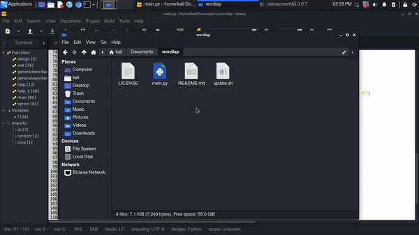

# Wordlap
A wordlist generator which is created in python

# Uses
lenght of words> [n1]
		When you put your input between [ ] that's mean it will only generate word of lenght number between [ ] 
You also have to define save file for generation

lenght of words> (n-n2)
Is not ready yet so don't test it
# Launch
``` 
$ cd wordlap
$ python main.py 
```

# For Linux
```
$ python3 main.py
```


# To update
```
$ bash update.sh
```

# Download 
` $ git clone https://github.com/XnetwolfX/wordlap `

# Watch the Video below if you don't know how to use wordlap. The same video works for Linux and Termux.


<p>You can download the video instead for how to use wordlap. Download the video with the link <a href="https://github.com/XnetwolfX/wordlap/raw/master/video-demo-of-wordlap.mp4" alt="Wordlap" download>here</a></p>
